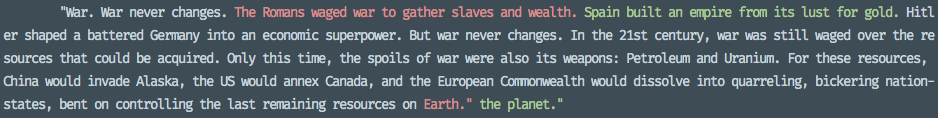

# PrettyDiffs

A small gem to lubricate your workflow with prettier than usual diffs.

## Motivation
When you make assertions between large strings with Minitest, for example JSON responses, it is laborious to identify what has changed. The usual workflow involves copy-pasting the output into a diff tool; a rather boring and time-consuming process.

Minitest chooses to compare strings using `diff`, which is line-oriented. However, 99% of the time, we do not intend to compare lines, we want just the words.

PrettyDiffs is a tool that supports this desire by overriding the default Minitest method, and relieves our workflow.

### Default Diff output


### Diff output using PrettyDiffs


## Installation

### Install [wdiff](https://www.gnu.org/software/wdiff/) on your system:
Wdiff is a wrapper around diff,  it works by creating two temporary files, one word per line, and then executes diff on these files. It collects the diff output and uses it to produce a nicer display of word differences between the original files.

```
# mac
$ brew install wdiff 

# linux
$ apt get-install wdiff 
```

### Install the PrettyDiffs module:

Add this line to your application's Gemfile:

```ruby
group :test do
  gem 'pretty-diffs'
end
```

And then execute:

```
$ bundle
```

Or install it yourself as:

```
$ gem install pretty-diffs
```

## How to use
Include the module in the Minitest classes to trigger the pretty diffs:

```ruby
require 'pretty_diffs'

module ActiveSupport

  class TestCase
    include PrettyDiffs

  end
end
```

### Get the previous output back!
In this rare case, set the following ENV variable:

```
MINITEST_PLAIN_BORING_DIFF='yes'
```

## Tasks for version 1.1.0
* Pure JSON output instead of Hash when comparing JSON responses in controller tests, so to copy-paste directly.

## Contributing

1. Fork it
2. Create your feature branch (`git checkout -b my-new-feature`)
3. Commit your changes (`git commit -am 'Add some feature'`)
4. Push to the branch (`git push origin my-new-feature`)
5. Create new Pull Request
